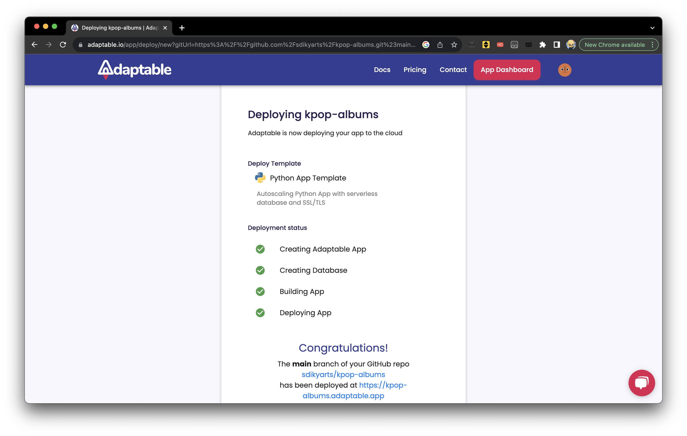

# Identitas
Nama                : Yasmine Putri Viryadhani<br>
NPM                 : 2206081862<br>
Kelas               : PBP A<br>
Nama App            : K-Pop Albums<br>
Link App Adaptable  : https://kpop-albums.adaptable.app/ (emang lagi error)

<p>
<details id = "app deta">
<summary><h1>Penjelasan App</h1></summary>

<p>
<details id = "background">
<summary><h2>Latar Belakang</h2></summary>

- Tema besar aplikasi untuk tugas PBP adalah aplikasi pengelolaan (inventori). 
- Tema yang saya pilih adalah <b>inventori album K-Pop</b> .
- Banyaknya jumlah grup yang debut dan album yang dirilis sehingga memungkinkan untuk dilakukan pengorganisasian album berdasarkan artis yang merilis album tersebut.


</details>
</p>

<p>
<details id = "context">
<summary><h2>Context / Contoh Sampel</h2></summary>

- Grup yang saya gunakan sebagai contoh untuk membangun proyek ini adalah [<b>NCT</b>](https://en.m.wikipedia.org/wiki/NCT_(group)) dan [<b>Stray Kids</b>](https://en.wikipedia.org/wiki/Stray_Kids)


</details>
</p>

</details>
</p>


<p>
<details id = "checklist-tugas">
<summary><h1>Checklist Tugas</h1></summary>

<!-- Markdown content here -->
<p>
<details id = "proyek-django">
<summary><h2>Membuat sebuah proyek Django baru<h2></summary>

<!-- Markdown content here -->
### Inisiasi Direktori Lokal
- Sebelum membuat proyek Django, dibuatlah sebuah direktori kosong baru di lokal. Saya menamainya sebagai <code>kpop_albums</code>
- Setelah membuat direktori, kita harus menginisiasi repositori Git kosong di direktori tersebut dengan perintah <code>git_init</code>
- Lalu, kita harus mengkonfigurasi username dan email GitHub ke repositori Git tersebut di Terminal (MacOS) dengan cara:
    ```
    git config user.name "<NAME>"
    git config user.email "<EMAIL>"
    ```
- Kita juga bisa mengkonfigurasi secara global dengan cara:<br>
    ```
    git config --global user.name "<NAME>"
    git config --global user.email
    ```
- Verifikasi git lokal dengan menginput kode <code>git config --list --local</code>

### Membuat repository baru di GitHub


### Instalasi + Inisiasi Django pada repository
- Menambahkan virtual environment ke dalam directory <code>kpop_albums</code> dengan menjalankan kode <code>python3 -m venv env</code> (di MacOS)
- Menjalankan virtual environment dengan cara <code>source env/bin/activate</code> (MacOS)
- Menyiapkan Dependencies dengan membuat berkas <code>requirements.txt</code> di directory yang sama, lalu menambahkan kode di bawah ke dalam berkas <code>.txt</code> tersebut:<br>
    ```
    django
    gunicorn
    whitenoise
    psycopg2-binary
    requests
    urllib3                   
    ```
- Install dependencies dengan menjalankan <code>pip install -r requirements.txt</code>
- Buat proyek Django dengan nama <code>kpop_albums</code> dengan menjalankan perintah <code>django-admin startproject kpop_albums .</code>
- Tambahkan <code>*</code> pada <code>ALLOWED_HOSTS</code> di <code>settings.py</code><br>
    ```
    ...
    ALLOWED_HOSTS = ["*"]
    ...
    ```
- Setelah memastikan file <code>manage.py</code> ada di directory, jalankan instruksi <code>./manage.py runserver</code> (MacOS). Saat menjalankan domain http://localhost:8000 muncul animasi roket

### Push ke repository GitHub
- Buat file <code>.gitignore</code> (masih di directory <code>kpop_albums</code> yng luar), lalu isi dengan kode berikut <br>
    ```
    # Django
    *.log
    *.pot
    *.pyc
    __pycache__
    db.sqlite3
    media

    # Backup files
    *.bak 

    # If you are using PyCharm
    # User-specific stuff
    .idea/**/workspace.xml
    .idea/**/tasks.xml
    .idea/**/usage.statistics.xml
    .idea/**/dictionaries
    .idea/**/shelf

    # AWS User-specific
    .idea/**/aws.xml

    # Generated files
    .idea/**/contentModel.xml

    # Sensitive or high-churn files
    .idea/**/dataSources/
    .idea/**/dataSources.ids
    .idea/**/dataSources.local.xml
    .idea/**/sqlDataSources.xml
    .idea/**/dynamic.xml
    .idea/**/uiDesigner.xml
    .idea/**/dbnavigator.xml

    # Gradle
    .idea/**/gradle.xml
    .idea/**/libraries

    # File-based project format
    *.iws

    # IntelliJ
    out/

    # JIRA plugin
    atlassian-ide-plugin.xml

    # Python
    *.py[cod] 
    *$py.class 

    # Distribution / packaging 
    .Python build/ 
    develop-eggs/ 
    dist/ 
    downloads/ 
    eggs/ 
    .eggs/ 
    lib/ 
    lib64/ 
    parts/ 
    sdist/ 
    var/ 
    wheels/ 
    *.egg-info/ 
    .installed.cfg 
    *.egg 
    *.manifest 
    *.spec 

    # Installer logs 
    pip-log.txt 
    pip-delete-this-directory.txt 

    # Unit test / coverage reports 
    htmlcov/ 
    .tox/ 
    .coverage 
    .coverage.* 
    .cache 
    .pytest_cache/ 
    nosetests.xml 
    coverage.xml 
    *.cover 
    .hypothesis/ 

    # Jupyter Notebook 
    .ipynb_checkpoints 

    # pyenv 
    .python-version 

    # celery 
    celerybeat-schedule.* 

    # SageMath parsed files 
    *.sage.py 

    # Environments 
    .env 
    .venv 
    env/ 
    venv/ 
    ENV/ 
    env.bak/ 
    venv.bak/ 

    # mkdocs documentation 
    /site 

    # mypy 
    .mypy_cache/ 

    # Sublime Text
    *.tmlanguage.cache 
    *.tmPreferences.cache 
    *.stTheme.cache 
    *.sublime-workspace 
    *.sublime-project 

    # sftp configuration file 
    sftp-config.json 

    # Package control specific files Package 
    Control.last-run 
    Control.ca-list 
    Control.ca-bundle 
    Control.system-ca-bundle 
    GitHub.sublime-settings 

    # Visual Studio Code
    .vscode/* 
    !.vscode/settings.json 
    !.vscode/tasks.json 
    !.vscode/launch.json 
    !.vscode/extensions.json 
    .history
    ```
- Lakukan add, commit, dan push dari directory <code>kpop_albums</code> ke branch <code>main</code> di repository GitHub <code>kpop_albums</code> (ini akan mem-push README.md, proyek Django, dan .gitignore ke repository)<br>
    ```
    git add .
    git commit -m "Push README + .gitignore + proyek"
    git branch -M main
    git remote add origin "https://github.com/sdikyarts/kpop-albums.git"
    git push -u origin main
    ```
- Pastikan struktur direktori lokal dan repository GitHub sudah benar

</details>
</p>

<p>
<details id = "app-making">
<summary><h2>Membuat aplikasi <code>main</code> dalam proyek tersebut<h2></summary>

<!-- Markdown content here -->
### Konfigurasi model dan implementasi model dasar
- Aktifkan virtual environment terlebih dahulu
- Buat aplikasi <code>main</code> di directory <code>kpop_albums</code> (yang luar/utama) dengan cara
    ```
    python3 manage.py startapp main
    ```
- Mendaftarkan aplikasi <code>main</code> ke dalam proyek
    - Buka berkas <code>settings.py</code>
    - Tambahkan <code>'main'</code> di variabel <code>INSTALLED_APPS</code><br>
    ```
    INSTALLED_APPS = [
        ...,
        'main',
        ...
    ]
    ```
### Membuat dan mengisi berkas <code>main.html</code>
- Buat direktori baru <code>templates</code> di dalam direktori <code>main</code>
- Di dalam direktori baru <code>templates</code>, buat berkas HTML baru berjudul <code>main.html</code>, lalu isi sesuai selera :D
- Ada total 4 halaman HTML yang saya buat:
    1. [<code>main.html</code>](https://github.com/sdikyarts/kpop-albums/blob/main/main/templates/main.html) sebagai halaman utama
    2. [<code>artists.html</code>](https://github.com/sdikyarts/kpop-albums/blob/main/main/templates/artists.html) sebagai halaman artis yang disesuaikan dengan nama artis
    3. [<code>albums.html</code>](https://github.com/sdikyarts/kpop-albums/blob/main/main/templates/albums.html) sebagai halaman album yang disesuaikan dengan nama album
    4. [<code>full_list.html</code>](https://github.com/sdikyarts/kpop-albums/blob/main/main/templates/full_list.html) sebagai daftar artis dan album mereka dalam bentuk list and bullets

</details>
</p>

<p>
<details id = "routing-app">
<summary><h2>Membuat sebuah <i>routing</i> pada proyek agar dapat menjalankan aplikasi <code>main</code><h2></summary>

<!-- Markdown content here -->
### Konfigurasi <i>routing</i> app main
- Buat berkas <code>urls.py</code> di directory aplikasi, kemudian isi
- Isi berkas lengkap bisa dilihat [disini](https://github.com/sdikyarts/kpop-albums/blob/main/main/urls.py)

</details>
</p>

<p>
<details id = "model-making">
<summary><h2>Membuat model pada aplikasi <code>main</code> dengan nama <code>Item</code><h2></summary>

<!-- Markdown content here -->
### Wajib mengandung atribut-atribut berikut:
- <code>name</code> sebagai nama *item* dengan tipe <code>CharField</code>
- <code>amount</code> sebagai jumlah *item* dengan tipe <code>IntegerField</code>
- <code>description</code> sebagai deskripsi *item* dengan tipe <code>TextField</code>

### Mengubah berkas <code>models.py</code> pada aplikasi <code>main</code>, lalu membuat dan mengaplikasikan migrasi model
- Buka berkas <code>models.py</code> di dalam direktori aplikasi <code>main</code>
- Isi berkas lengkap bisa dilihat [disini](https://github.com/sdikyarts/kpop-albums/blob/main/main/models.py)
- Jalankan perintah berikut untuk membuat berkas migrasi yang berisi perubahan model yang belum diaplikasikan ke dalam basis data
    ```
    python3 manage.py makemigrations
    ```
- Jalankan perintah berikut untuk menerapkan migrasi ke dalam basis data lokal
    ```
    python3 manage.py migrate
    ```
- <code>makemigrations</code> dan <code>migrate</code> dilakukan setiap kali kita memodifikasi <code>models.py</code>

</details>
</p>


<p>
<details id = "view-making">
<summary><h2>Membuat sebuah fungsi pada <code>views.py</code> untuk dikemballikan ke dalam sebuah template HTML yang menampilkan nama dan kelas<h2></summary>

<!-- Markdown content here -->
### Mengintegrasikan komponen MVT
- Buka berkas <code>views.py</code>
- Tambahkan baris impor di bagian paling atas
    ```
    from django.shortcuts import render
    ```
- Isi berkas lengkap bisa dilihat [disini](https://github.com/sdikyarts/kpop-albums/blob/main/main/views.py)
- Penjelasan fungsi di dalam <code>views.py</code>:
    - <code>convert_date_string(date_string)</code> mengonversi format tanggal dari "Bulan Tanggal, Tahun" menjadi "YYYY-MM-DD".

    - <code>get_artist_data()</code> mengembalikan sebuah context yang beris data dari artis beserta detailnya, seperti nama artis, agensi, tanggal debut, anggota, mantan anggota, sub-unit, nama fandom, deskripsi, dan informasi album.

    - <code>show_main(request: HttpRequest) -> HttpResponse</code> menampilkan halaman utama aplikasi yang mencakup pengurutan artis secara alfabetis dan penentuan album of the day

    - <code> show_artist_detail(request: HttpRequest, artist_name: str) -> HttpResponse</code> menampilkan halaman detail artis berdasarkan nama artis

    - <code>show_album_detail(request, artist_name, album_name)</code> menampilkan halaman detail album berdasarkan nama artis dan nama album

    - <code>show_full_list(request)</code> menampilkan halaman daftar lengkap artis yang dalam urutan alfabetis beserta album yang pernah mereka rilis

</details>
</p>

<p>
<details id = "routing-project">
<summary><h2>Membuat sebuah <i>routing</i> pada <code>urls.py</code> untuk memetakan fungsi yang telah dibuat pada views.py<h2></summary>

<!-- Markdown content here -->
### Konfigurasi <i>routing</i> proyek kpop-albums
- Buat berkas <code>urls.py</code> di directory proyek (terluar)
- impor fungsi <code>include</code> dari <code>django.urls</code>
    ```
    ...
    from django.urls import path, include
    ...
    ```
- Tambahkan URL berikut untuk mengarahkan tampilan main di dalam variabel <c>urlpatterns</c>
    ```
    urlpatterns = [
        ...
        path('main/', include('main.urls')),
        ...
    ]
    ```
- Jalankan projek Django dengan perintah <code>python3 manage.py runserver</code> (MacOS)
- Buka http://localhost:8000/main/ untuk test webnya

</details>
</p>

<p>
<details>
<summary><h2>Melakukan <i>deployment</i> ke Adaptable terhadap aplikasi yang sudah dibuat (udah deploy berhasil tapi gak keload webnya)<h2></summary>

<!-- Markdown content here -->
- Login ke [Adaptable.io](https://adaptable.io/)
- Tekan tombol <code>New App</code> lalu pilih <code>Connect an Existing Repository</code>
- Hubungkan [Adaptable.io](https://adaptable.io/) dengan GitHub dan pilih <code>All Repositories</code> pada proses instalasi
- Pilih proyek <code>kpop_albums</code> sebagai basis aplikasi yang akan di-deploy
- Pilih branch <code>main</code>
- Pilih <code>Python App Template</code> sebagai template deployment
- Pilih <code>PostgreSQL</code> sebagai tipe database yang digunakan
- Sesuaikan versi Python dengan spek aplikasi (saya memakai versi 3.10). Trik: gunakan command <code>python3 --version</code> (MacOS)
- Pada bagian <code>Start Command</code>, masukkan perintah <code>python3 manage.py migrate && gunicorn shopping_list.wsgi</code> (MacOS)
- Masukkan nama aplikasi <code>kpop-albums</code> sebagai nama domain situs web aplikasi
- Centang bagian <code>HTTP Listener on PORT</code> dan klik <code>Deploy App</code> untuk mendeploy app



</details>
</p>

## Membuat <code>README.md</code>

<p>
<details id = "testing">
<summary><h2>Bonus: Melakukan Testing<h2></summary>

<!-- Markdown content here -->
### Membuat Unit Test
- Buka berkas <code>tests.py</code> di directory main
- Isi berkas lengkap bisa dilihat [disini](https://github.com/sdikyarts/kpop-albums/blob/main/main/tests.py)

</details>
</p>

</details>
</p>

# Pertanyaan
## 1. Jelaskan bagaimana cara kamu mengimplementasikan checklist di atas secara step-by-step (bukan hanya sekadar mengikuti tutorial)
- Baca bagian spoiler Checklist Tugas di atas

## 2. Buatlah bagan yang berisi request client ke web aplikasi berbasis Django beserta responnya dan jelaskan pada bagan tersebut kaitan antara <code>urls.py</code>, <code>views.py</code>, <code>models.py</code>, dan berkas <code>html</code>

<p>Sumber: https://developer.mozilla.org/en-US/docs/Learn/Server-side/Django/Home_page</p>

## 3. Jelaskan mengapa kita menggunakan virtual environment? Apakah kita tetap dapat membuat aplikasi web berbasis Django tanpa menggunakan virtual environment?
- Virtual environment digunakan untuk mengisolasi dan mengelola dependensi Python dalam proyek yang dibuat
- Hal ini bertujuan untuk memastikan bahwa setiap proyek memiliki lingkungan yang terpisah, menghindari konflik, meningkatkan kebersihan, dan memudahkan pemeliharaan antar satu proyek dengan proyek lain
- Kita bisa saja membuat app Django tanpa virtual environment. Namun, untuk mengurangi risiko konflik versi paket serta membuat pengerjaan lebih rapi dan terorganisasi, maka sebaiknya kita menggunakan virtual environment.

## 4. Jelaskan apakah itu MVC, MVT, MVVM dan perbedaan dari ketiganya.
1. **MVC (Model-View-Controller)**:
   - **Model**: Representasi dari data dan logika bisnis aplikasi. Ini mengurus semua data dan aturan bisnis.
   - **View**: Bertanggung jawab untuk tampilan antarmuka pengguna. Ini menampilkan data dari Model dan mengirim input pengguna ke Controller.
   - **Controller**: Bertindak sebagai penghubung antara Model dan View. Ini menerima input pengguna dari View, memprosesnya, dan memperbarui Model atau View sesuai kebutuhan.
   - Pada arsitektur ini, Controller berfungsi sebagai perantara antara Model dan View.

2. **MVT (Model-View-Template)**:
   - **Model**: Mirip dengan MVC, ini mengurus data dan logika bisnis.
   - **View**: Menangani tampilan antarmuka pengguna seperti pada MVC.
   - **Template**: Ini adalah perbedaan utama dengan MVC. Template adalah lapisan yang terpisah yang digunakan untuk menghasilkan tampilan HTML dinamis. Template berisi markup HTML dan bahasa templating yang digunakan untuk mengisi data dari Model ke View.
   - Dalam MVT, Template digunakan untuk memisahkan tampilan dari kode aplikasi, sedangkan di MVC, View biasanya lebih tahu tentang logika tampilan.

3. **MVVM (Model-View-ViewModel)**:
   - **Model**: Mirip dengan MVC dan MVT, ini mengurus data dan bisnis logic.
   - **View**: Bertanggung jawab untuk tampilan antarmuka pengguna seperti pada MVC dan MVT.
   - **ViewModel**: Ini adalah komponen tambahan yang berperan sebagai perantara antara Model dan View. ViewModel mengubah data dari Model ke bentuk yang dapat ditampilkan di View. Ini memungkinkan pemisahan yang lebih besar antara tampilan dan logika aplikasi, dan juga mendukung binding data dua arah antara View dan Model.
   - MVVM memungkinkan View untuk lebih independen dari Model dibandingkan dengan MVC atau MVT, karena ViewModel bertanggung jawab atas sebagian besar logika tampilan.
