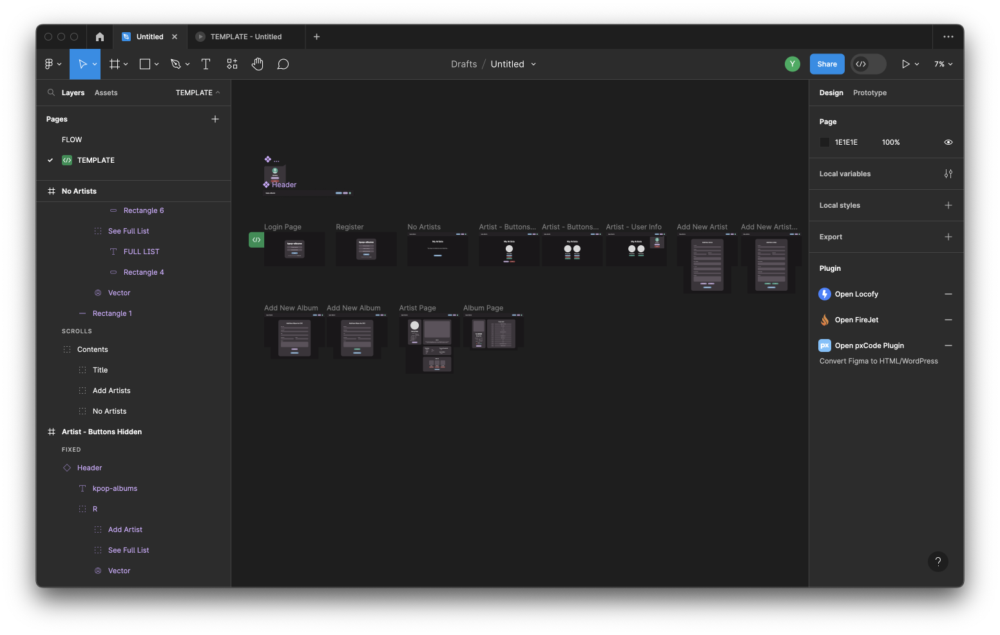

# Identitas
Nama                : Yasmine Putri Viryadhani<br>
NPM                 : 2206081862<br>
Kelas               : PBP A<br>
Nama App            : K-Pop Albums<br>
Link App            : 


# Karena keterbatasan waktu (berbarengan dengan deadline TP 1 SDA), tampilan Tugas 5 yang lengkap baru akan jadi setelah deadline tugas 5 / 12.00 (harap maklum hehehe)
## Halaman yang sudah jadi: Login
## Klo memungkinkan nilai pake commit yang selanjutnya (setelah deadline)

# Penjelasan App
## Latar Belakang
- Tema besar aplikasi untuk tugas PBP adalah aplikasi pengelolaan (inventori)
- Tema yang saya pilih adalah <b>inventori album K-Pop</b>
- Banyaknya jumlah grup yang debut dan album yang dirilis sehingga memungkinkan untuk dilakukan pengorganisasian album berdasarkan artis yang merilis album tersebut

## Contoh Proyek
- Grup-grup yang saya gunakan sebagai contoh untuk membangun proyek ini adalah [**NCT**](https://en.m.wikipedia.org/wiki/NCT_(group)) dan [**Stray Kids**](https://en.wikipedia.org/wiki/Stray_Kids)
    - Karena keterbatasan waktu dalam *development* proyek ini, grup-grup lain akan ditambahkan seiring waktu
- **UPDATE TUGAS 4:** Dikarenakan Tugas 4 memerlukan dua contoh *dummy accounts*, maka test case yang saya pakai untuk masing-masing user akan terdiri dari grup berikut:
    - User <code>dummy</code>: [**Stray Kids**](https://en.wikipedia.org/wiki/Stray_Kids) dan [**NewJeans**](https://en.m.wikipedia.org/wiki/NewJeans)
    - User <code>tester</code>: [**NCT**](https://en.m.wikipedia.org/wiki/NCT_(group)) dan [**TWICE**](https://en.wikipedia.org/wiki/Twice)

## Tampilan App (Tugas 4)
<details>
<summary>Spoiler</summary>

### Log In / Log Out


### Register


### Add Artist


### Add Album


### Delete Artist


### Delete Album


### Add/Minus Amount

</details>

## Progres Tugas Lampau
- Progres **Tugas 2**
    <details>
    <summary>Show Images</summary>

    
    </details>
- Progres **Tugas 3**
    <details>
    <summary>Show Images</summary>

    
    </details>


# Checklist 
## Checklist Tugas 3
<details>
<summary>Spoiler</summary>

## ✅ Membuat input form untuk menambahkan objek model pada app sebelumnya.

### 1. Routing dari <code>main/</code> ke <code>/</code>
- Setelah menyalakan Virtual Environment dengan command <code>source env/bin/activate</code> (MacOS), saya memodifikasi <code>urls.py</code> yang ada di *root directory* <code>kpop_albums</code> dengan mengubah path <code>main</code> menjadi <code>''</code> pada bagian <code>urlpatterns</code>
<br>
    


### 2. Implementasi Skeleton sebagai Kerangka dari Views
- Pada *root directory* <code>kpop_albums</code>, saya membuat folder baru bernama <code>templates</code>. 
- Lalu didalamnya, saya membuat berkas <code>base.html</code> yang berisi kerangka untuk file-file HTML yang ada
    - Isi <code>base.html</code> yang saya buat dapat dilihat di [sini](https://github.com/sdikyarts/kpop-albums/blob/main/templates/base.html)
- Di <code>settings.py</code> yang ada di *sub-directory* <code>kpop_albums</code>, saya memodifikasi bagian <code>TEMPLATES</code> seperti yang ada di kode spoiler di bawah:
    ```
    ...
    TEMPLATES = [
        {
            'BACKEND': 'django.template.backends.django.DjangoTemplates',
            'DIRS': [BASE_DIR / 'templates'], # Yang saya tambahkan ini
            'APP_DIRS': True,
            ...
        }
    ]
    ...
    ```

- Di *page-page* HTML yang ada di *directory* <code>templates</code> yang ada di *sub-directory* <code>main</code>, saya memodifikasi struktur masing-masing *page* dengan struktur yang ada di kode spoiler di bawah:
    <details>
    <summary>Show Code</summary>

    ```
    ...
    

    
        # Isi dengan apapun yang sebelumnya ada di <head>
        # Umumnya berisi syntax <title>
    

    
        # Isi dengan apapun yang sebelumnya ada di <body>
    
    ```
    </details>

### 3. Membuat Form Input Data
- Untuk efisiensi pengelolaan, saya mengganti model saya di <code>models.py</code> dari <code>Item</code> menjadi <code>Artist</code> dan <code>Album</code>
- Di *sub-directory* <code>main</code>, saya membuat file baru bernama <code>forms.py</code>
    - <code>forms.py</code> berfungsi untuk membuat struktur form yang dapat menerima data produk baru
    - Isi dari <code>forms.py</code> disesuaikan dengan *attributes* yang ada di <code>context</code> pada <code>forms.py</code>
    - Saya membuat dua forms, yaitu <code>ArtistForm</code> (untuk data artis) dan <code>AlbumForm</code> (untuk data album tiap artisnya)
    - Isi lengkap dari <code>forms.py</code> dapat dilihat di [sini](https://github.com/sdikyarts/kpop-albums/blob/main/main/forms.py)
- Di <code>views.py</code>, saya menambahkan bebrapa import dan fungsi baru untuk menghasilkan formulir yang dapat menambahkan data artis dan album secara otomatis ketika data di-submit dari form.
    - Fungsi untuk menambahkan data artis dan album akan dijelaskan di section berikutnya
    - Saya juga menambahkan function <code>reset</code> untuk menghapus semua artis dan album mereka
        <details>
        <summary>Show Code</summary>

        ```
        def reset_form(request):
        # Delete all form submissions (adjust this logic based on your needs)
        Artist.objects.all().delete()
        Album.objects.all().delete()
        
        # Redirect back to the main page or any other page you prefer
        return redirect('main:show_main')
        ```
        </details>
    - Isi lengkap dari <code>views.py</code> dapat dilihat di [sini](https://github.com/sdikyarts/kpop-albums/blob/main/main/views.py)
- Lalu saya buat dua berkas HTML baru bernama <code>add_artist.html</code> dan <code>add_album.html</code> pada *directory* <code>main/templates</code>
    - Berikut isi lengkap dari:
        - [<code>add_artist.html</code>]()
        - [<code>add_album.html</code>]()

## ✅ Menambahkan 5 fungsi views untuk melihat objek yang sudah ditambahkan dalam format HTML, XML, JSON, XML by ID, dan JSON by ID
### 1. Menampilkan Data Artis dan Album Pada HTML
- Terdapat dua fungsi menambah data artis dan album
    1. Fungsi <code>add_artist</code> untuk menambahkan artis melalui <code>ArtistForm</code>
        <details>
        <summary>Show Code</summary>

        ```
        def add_artist(request):
        if request.method == 'POST':
            form = ArtistForm(request.POST, request.FILES)
            if form.is_valid():
                form.save()
                # Fetch all artists again after adding a new one
                artists = Artist.objects.all()
                return render(request, 'main.html', {'artists': artists})  # Pass the updated list of artists to the main page
        else:
            form = ArtistForm()

        context = {'form': form}
        return render(request, "add_artist.html", context)
        ```
        </details>
    2. Fungsi <code>add_album</code> untuk menambahkan artis melalui <code>AlbumForm</code> untuk masing-masing artis yang sudah terdaftar
        <details>
        <summary>Show Code</summary>

        ```
        def add_artist(request):
        if request.method == 'POST':
            form = ArtistForm(request.POST, request.FILES)
            if form.is_valid():
                form.save()
                # Fetch all artists again after adding a new one
                artists = Artist.objects.all()
                return render(request, 'main.html', {'artists': artists})  # Pass the updated list of artists to the main page
        else:
            form = ArtistForm()

        context = {'form': form}
        return render(request, "add_artist.html", context)
        ```
        </details>
### 2. Menampilkan Data Produk Pada XML dan JSON
- Berikut potongan kode untuk XML dan JSON:
    <details>
    <summary>Show Code</summary>

    ```
    def show_xml(request):
        # Combine data from both Artist and Album models
        artist_data = Artist.objects.all()
        album_data = Album.objects.all()
        combined_data = list(artist_data) + list(album_data)

        # Serialize the combined data to XML format
        xml_data = serializers.serialize("xml", combined_data)

        return HttpResponse(xml_data, content_type="application/xml")

    def show_json(request):
        # Combine data from both Artist and Album models
        artist_data = Artist.objects.all()
        album_data = Album.objects.all()
        combined_data = list(artist_data) + list(album_data)

        # Serialize the combined data to JSON format
        json_data = serializers.serialize("json", combined_data)

        return HttpResponse(json_data, content_type="application/json")

    ```
    </details>
- Berikut potongan kode untuk XML dan JSON (by ID, hanya untuk Artis)
    <details>
    <summary>Show Code</summary>

    ```
    def show_xml_by_id(request, id):
        # Combine data from both Artist and Album models
        artist_data = Artist.objects.all().filter(pk=id)
        combined_data = list(artist_data)

        # Serialize the combined data to XML format
        xml_data = serializers.serialize("xml", combined_data)

        return HttpResponse(xml_data, content_type="application/xml")

    def show_json_by_id(request, id):
        # Combine data from both Artist and Album models
        artist_data = Artist.objects.all().filter(pk=id)
        combined_data = list(artist_data)

        # Serialize the combined data to JSON format
        json_data = serializers.serialize("json", combined_data)

        return HttpResponse(json_data, content_type="application/json")

    ```
    </details>
## ✅ Membuat routing URL untuk masing-masing views yang telah ditambahkan di poin 2
- Di <code>urls.py</code> pada *sub-directory* <code>main</code>, saya menambahkan import dan kode berikut untuk menambahkan path
    ```
    urlpatterns = [
        ...
        
        # tambahan baru
        path('add-artist', add_artist, name='add_artist'),
        path('add_album/<str:artist_name>/', add_album, name='add_album'),
        path('reset_form/', reset_form, name='reset_form'),
    ]
    ```
## ✅ Mengakses kelima URL di poin 2 menggunakan Postman, membuat screenshot dari hasil akses URL pada Postman
HTML di Postman


XML di Postman


JSON di Postman


XML by ID di Postman


JSON by ID di Postman

</details>

## Checklist Tugas 4
<details>
<summary>Spoiler</summary>

## ✅ Mengimplementasikan fungsi registrasi, login, dan logout untuk memungkinkan pengguna untuk mengakses aplikasi sebelumnya dengan lancar

### 1. Membuat Fungsi dan Form Registrasi
- Setelah menjalankan virtual environment, kita ingin membuat page kita restricted hanya untuk pengguna.
- Pertama, saya mengimpor potongan kode berikut di <code>views.py</code>:
    ```
    from django.shortcuts import redirect
    from django.contrib.auth.forms import UserCreationForm
    from django.contrib import messages  
    ```
- Kemudian, saya membuat form registrasi kustom di <code>forms.py</code>. 
    - Hal ini dikarenakan <code>UserCreationForm</code> secara default memiliki *messages* yang menampilkan syarat username dan password yang dibuat. 
    - Saya ingin beberapa penamaan label di form tersebut untuk diganti, sehingga cara terbaik untuk melakukannya adalah membuat form registrasi kustom.
    - Untuk membuat form kustom, saya mengimpor <code>UserCreationForm</code> dan <code>User</code> di forms.py
        <details>
        <summary>Show Code</summary>

        ```
        from django.contrib.auth.forms import UserCreationForm
        from django.contrib.auth.models import User
        ...

        # Portongan Kode yang Sudah Ada

        ...
        # Class untuk modifikasi form Register
        class RegisterForm(UserCreationForm):
            class Meta:
                model = User  # Make sure to import User from django.contrib.auth.models
                fields = ['username', 'password1', 'password2']

            username = forms.CharField(
                label = 'Username',
            )

            password1 = forms.CharField(
                label = 'Password',
            )

            password2 = forms.CharField(
                label = 'Confirm Password',
            )

        ```
        </details>
- Di  <code>views.py</code>, saya membuat fungsi untuk menampilkan form register dengan mengimpor yang sudah kita buat
    <details>
    <summary>Show Code</summary>

    ```
    from .forms import RegisterForm 
    ...

    ...
    def register(request):
    form = RegisterForm()

    if request.method == "POST":
        form = RegisterForm(request.POST)
        if form.is_valid():
            form.save()
            messages.success(request, 'Your account has been successfully created!')
            return redirect('main:login')
        
    context = {'form':form}
    return render(request, 'register.html', context)

    ```
    </details>
- Setelah itu, saya membuat <code>register.html</code> yang kode lengkapnya dapat dilihat di [sini](https://github.com/sdikyarts/kpop-albums/blob/main/main/templates/register.html)
- Kemudian di <code>urls.py</code> yang ada di *subdirectory* <code>main</code>, saya tambahkan path di <code>urlpatterns</code> agar web dapat mengakses <code>register.html</code>
    <details>
    <summary>Show Code</summary>

    ```
    from main.views import register
    ...

    ...
    urlpatterns = [
        ...

        # register, login, logout
        path('register/', register, name='register'),
    ]

    ```
    </details>
### 2. Membuat Fungsi dan Form Registrasi
- Di  <code>views.py</code>, saya membuat fungsi untuk menampilkan halaman login pengguna
    <details>
    <summary>Show Code</summary>

    ```
    from django.contrib.auth import authenticate, login 
    ...

    ...
    def login_user(request):
    if request.method == 'POST':
        username = request.POST.get('username')
        password = request.POST.get('password')
        user = authenticate(request, username=username, password=password)
        if user is not None:
            login(request, user)
            response = HttpResponseRedirect(reverse("main:show_main")) 
            response.set_cookie('last_login', str(datetime.datetime.now()))
            return response
        else:
            messages.info(request, 'Sorry, incorrect username or password. Please try again.')
    context = {}
    return render(request, 'login.html', context)

    ```
    </details>
- Setelah itu, saya membuat <code>login.html</code> yang kode lengkapnya dapat dilihat di [sini](https://github.com/sdikyarts/kpop-albums/blob/main/main/templates/login.html)
- Kemudian di <code>urls.py</code> yang ada di *subdirectory* <code>main</code>, saya tambahkan path di <code>urlpatterns</code> agar web dapat mengakses <code>login.html</code>
    <details>
    <summary>Show Code</summary>

    ```
    from main.views import register, login_user
    ...

    ...
    urlpatterns = [
        ...

        # register, login, logout
        path('register/', register, name='register'),
        path('login/', login_user, name='login'),
    ]

    ```
    </details>
### 3. Membuat Fungsi Logout
- Di  <code>views.py</code>, saya membuat fungsi untuk menampilkan halaman login pengguna
    <details>
    <summary>Show Code</summary>

    ```
    from django.contrib.auth import logout
    ...

    ...
    def logout_user(request):
        logout(request)
        return redirect('main:login')
    ```
    </details>
- Setelah itu, saya membuat *button* logout di <code>main.html</code>
    ```
    <a href="">
        <button>
            Logout
        </button>
    </a>
    ```
- Kemudian di <code>urls.py</code> yang ada di *subdirectory* <code>main</code>, saya tambahkan path di <code>urlpatterns</code> agar web dapat mengakses <code>login.html</code>
    ```
    from main.views import logout_user
    ...

    ...
    urlpatterns = [
        ...

        # register, login, logout
        path('register/', register, name='register'),
        path('login/', login_user, name='login'),
        path('logout/', logout_user, name='logout'),
    ]

    ```
### 4. Merestriksi Akses Halaman Main
- Di  <code>views.py</code>, tambahan restriksi di atas fungsi <code>show_main</code>
    <details>
    <summary>Show Code</summary>

    ```
    from django.contrib.auth.decorators import login_required
    ...

    ...
    @login_required(login_url='/login')
    def show_main(request):
    ```
    </details>
## ✅ Membuat dua akun pengguna dengan masing-masing tiga dummy data menggunakan model yang telah dibuat pada aplikasi sebelumnya untuk setiap akun di lokal.
- Saya membuat dua akun untuk testing Tugas 4
    
    
- Untuk dummy data, lebih dari 3 karena atribut model yang saya pakai banyak
## ✅ Menampilkan detail informasi pengguna yang sedang logged in seperti username dan menerapkan cookies seperti last login pada halaman utama aplikasi.
### 1. Menggunakan Data Dari Cookie
- Jika masih login ke akun, maka logout terlebih dahulu
- Di  <code>views.py</code>, saya menambahkan import dan mengupdate <code>login_user</code>
    <details>
    <summary>Show Code</summary>

    ```
    import datetime
    from django.http import HttpResponseRedirect
    from django.urls import reverse
    ...

    ...
    def login_user(request):
        if request.method == 'POST':
            username = request.POST.get('username')
            password = request.POST.get('password')
            user = authenticate(request, username=username, password=password)
            if user is not None:
                login(request, user)
                response = HttpResponseRedirect(reverse("main:show_main")) 
                response.set_cookie('last_login', str(datetime.datetime.now()))
                return response
            else:
                messages.info(request, 'Sorry, incorrect username or password. Please try again.')
        context = {}
        return render(request, 'login.html', context)
    ```
    </details>
- Di <code>show_main</code>, saya menambahkan potongan kode ke dalam <code>data</code> agar dapat mengakses cookies
    ```
    ...
    def show_main(request):
        data = {
            'last_login': request.COOKIES['last_login']
        }
    ...
    ```
- Kemudian, saya memodifikasi isi <code>logout_user</code> agar dapat menghapus cookies saat logout
    ```
    ...
    def logout_user(request):
        logout(request)
        response = HttpResponseRedirect(reverse('main:login'))
        response.delete_cookie('last_login')
        return response
    ...
    ```
- Setelah itu, saya menambahkan bagian untuk show last login di <code>main.html</code>
    ```
    <h5>Last login: {{ data.last_login }}</h5>
    ```
### 2. Menampilkan detail informasi pengguna yang sedang logged in
- Jalankan checklist [Menghubungkan model <code>Item</code> dengan <code>User</code>](#menghubungkan-model-item-dengan-user) terlebih dahulu (kecuali migrasi model)
- Di <code>show_main</code>, tambahkan atribut untuk mengakses username
    ```
    ...
    def show_main(request):
        data = {
            'name': request.user.username,
            ...
        }
    ...
    ```
- Di <code>main.html</code>, tambahkan bagian untuk menampilkan username
    ```
    ...
    <h4>Logged in as {{ request.user.username }}</h3>
    ...
    ```
- Lanjut ke tahap migrasi model di checklist yang tadi

## ✅ Menghubungkan model <code>Item</code> dengan <code>User</code>
- Saya mengimpor import dan menambahkan potongan kode untuk atribut user di setiap model untuk menghubungkan model-model tersebut dengan user
    ```
    ...
    from django.contrib.auth.models import User
    
    class Artist(models.Model):
        user = models.ForeignKey(User, on_delete=models.SET_NULL, null=True)
        ...
    ...

    class Album(models.Model):
        user = models.ForeignKey(User, on_delete=models.SET_NULL, null=True)
        ...
    ...
    ```
- Saya mengupdate <code>add_album</code> di <code>views.py</code> sebagai berikut agar dapat menambahkan album bagi artis yang telah ditambahkan oleh user
    <details>
    <summary>Show Code</summary>

    ```
    ...
    def add_album(request, artist_name):
        artist = Artist.objects.get(name=artist_name, user=request.user)  # Ensure the artist belongs to the current user

        if request.method == 'POST':
            form = AlbumForm(request.POST, request.FILES)

            if form.is_valid():
                album = form.save(commit=False)
                album.artist = artist  # Associate the album with the artist
                album.company = artist.company  # Set the album's company to be the same as the artist's company
                album.save()
                return HttpResponseRedirect(reverse('main:artist_detail', args=[artist_name]))
        else:
            # Pass the artist name and company as context to the template
            form = AlbumForm(initial={'artist': artist, 'company': artist.company})

        return render(request, 'add_album.html', {'form': form, 'artist': artist, 'artist_name': artist_name})
    ...
    ```
    </details>
- Pastikan bahwa model yang dipakai di <code>views.py</code> sudah difilter berdasarkan user
    <details>
    <summary><code>show_main</code></summary>

    ```
    ...
    def show_main(request):
        template_name = 'main.html'

        artists = Artist.objects.all().filter(user=request.user).order_by('name')

        artist_data_list = []  # Initialize an empty list to store artist data

        data = {
            'name': request.user.username,
            'last_login': request.COOKIES['last_login']
        }

        for artist in artists:
            artist_data = {
                'name': artist.name,
                'artist_logo_url': artist.artist_logo.url,
                'albums_count': Album.objects.filter(artist=artist).count(),
                # Add other artist data as needed
            }
            artist_data_list.append(artist_data)

        return render(request, template_name, {'data': data, 'artists': artist_data_list})
    ...
    ```
    </details>

    <details>
    <summary><code>show_artist_detail</code></summary>

    ```
    ...
    def show_artist_detail(request, artist_name):
        artist_data = Artist.objects.get(name=artist_name)
        artist_data.former_members = artist_data.former_members.split(',') if artist_data.former_members else []
        artist_data.members = artist_data.members.split(',') if artist_data.members else []
        artist_data.sub_units = artist_data.sub_units.split(',') if artist_data.sub_units else []
        artist_data.supporters = artist_data.supporters.split(',') if artist_data.supporters else []

        # Retrieve the albums associated with the artist
        artist_albums = Album.objects.filter(artist=artist_data).order_by('release_date')

        template_name = 'artists.html'

        return render(request, template_name, {'artist_data': artist_data, 'artist_albums': artist_albums})
    ...
    ```
    </details>

    <details>
    <summary><code>show_album_detail</code></summary>

    ```
    ...
    def show_album_detail(request, artist_name, album_name):
        # Retrieve the album data
        album_data = Album.objects.get(artist__name=artist_name, name=album_name)
        album_data.tracklist = album_data.tracklist.split(',') if album_data.tracklist else []

        # Retrieve the associated artist data
        artist_data = Artist.objects.get(name=artist_name)

        template_name = 'albums.html'

        return render(request, template_name, {'album_data': album_data, 'artist_data': artist_data, 'artist_name': artist_name})
    ...
    ```
    </details>

    <details>
    <summary><code>show_full_list</code></summary>

    ```
    ...
    def show_full_list(request):
        # Retrieve all artists from the Artist model
        artists = Artist.objects.all().filter(user=request.user).order_by('name')

        template_name = 'full_list.html'

        # Pass the list of artists to the template without removing duplicates
        return render(request, template_name, {'artists': artists})
    ...
    ```
    </details>
- Setelah [menampilkan username](#2-menampilkan-detail-informasi-pengguna-yang-sedang-logged-in) di <code>main.html</code>, lakukan migrasi model dan terapkan default value sesuai dengan apa yang Django sarankan
## BONUS: Menambahkan tombol untuk menambah dan/atau mengurangi amount barang
- Saya menerapkan bonus ini pada model <code>Album</code>
- Di <code>albums.html</code>, saya modifikasi bagian yang menampilkan <code>amount</code> agar dapat menampilkan tombol plus minus
    ```
    ...
    <!-- Add plus and minus buttons to adjust the amount -->
    <p>
        <b>Amount:</b> 
        <span id="amount">{{ album_data.amount }}</span> 
        <button id="minus" class="amount-button" style="margin-left:7px">-</button> 
        <button id="plus" class="amount-button">+</button>
    </p>
    ...
    ```
- Di <code>views.py</code>, saya buat fungsi untuk mengupdate amount
    <details>
    <summary>Show Code</summary>

    ```
    def update_album_amount(request, album_id):
        # Get the album object by its ID
        album = Album.objects.get(pk=album_id)

        # Check if the request method is POST
        if request.method == 'POST':
            action = request.POST.get('action', None)

            # Update the album amount based on the action
            if action == 'plus':
                album.amount += 1
            elif action == 'minus':
                if album.amount > 0:
                    album.amount -= 1

            # Save the updated album object
            album.save()

            return JsonResponse({'success': True, 'new_amount': album.amount})

    ```
    </details>
- Kembali ke <code>albums.html</code>, saya tambahkan script jQuery untuk menghandle peng-klikan tombol plus minus
    <details>
    <summary>Show Code</summary>

    ```
    ...
    <!-- Include jQuery library -->
    <script src="https://code.jquery.com/jquery-3.6.0.min.js"></script>

    <!-- Add JavaScript to handle plus and minus button clicks -->
    <script>
        // Wait for the document to be ready
        $(document).ready(function() {
            // Use event delegation to handle button clicks
            $('#plus').on('click', function() {
                updateAmount('plus');
            });

            $('#minus').on('click', function() {
                updateAmount('minus');
            });
        });

        // Function to update the album amount
        function updateAmount(action) {
            $.post(
                "",
                { action: action, csrfmiddlewaretoken: "{{ csrf_token }}" },
                function(data) {
                    if (data.success) {
                        // Update the displayed amount
                        $('#amount').text(data.new_amount);
                    } else {
                        console.error(data.message);
                    }
                }
            );
        }
    </script>
    ...
    ```
    </details>
- Hasilnya, ketika kita menekan tombol plus-minus, amount album yang dikenakan tambah-kurang akan ter-update
- Saya juga sudah menodifikasi tampilan halaman [<code>full_list.html</code>](https://github.com/sdikyarts/kpop-albums/blob/main/main/templates/full_list.html) agar lebih berwarna dan terkoordinasi
## BONUS: Menambahkan tombol untuk menghapus suatu objek dari inventori
### 1. Menghapus Artis dari inventori
- Menghapus artis berarti juga menghapus album yang dimiliki artis tersebut dari inventori
- Di <code>views.py</code>, saya buat fungsi baru untuk menghapus artis
    <details>
    <summary>Show Code</summary>
    ```
    def delete_artist(request, artist_name):
        # Ensure the artist belongs to the current user and delete it
        artist = Artist.objects.filter(name=artist_name, user=request.user).first()
        if artist:
            # Delete albums associated with the artist
            Album.objects.filter(artist=artist).delete()
            artist.delete()
        return redirect('main:show_main')
    ```
    </details>
- Lalu, saya memodifikasi <code>main.html</code> agar muncul tombol untuk menghapus artis secara individu
    <details>
    <summary>Show Code</summary>
    
    ```
    <div class="artist-list">
        
            <ul style="list-style: none; padding: 0; margin: 0;">
                
                <li style="display: inline-block; margin-right: 10px;">
                    <ul>
                        ...
                        <a href="" class="delete-link" style="display: block; width: 100px; margin-top: 5px;">
                            <button class="delete-button" style="display: block; width: 100px; margin-top: 5px;">
                                Delete Artist
                            </button>
                        </a>
                    </ul>
                </li>
                
            </ul>
        
            <p>No artists added</p>
        
    </div>  
    ```
    </details>
### 2. Menghapus Album dari inventori
- Menghapus album hanya menghapus salah satu album yang dimiliki oleh artis
- Di <code>views.py</code>, saya buat fungsi baru untuk menghapus album
    <details>
    <summary>Show Code</summary>
    ```
    def delete_album(request, artist_name, album_name):
        # Ensure the album belongs to the current user and delete it
        album = Album.objects.filter(artist__name=artist_name, name=album_name, artist__user=request.user).first()
        if album:
            album.delete()
        return redirect('main:artist_detail', artist_name=artist_name)
    ```
    </details>
- Lalu, saya memodifikasi <code>artists.html</code> agar muncul tombol untuk menghapus artis secara individu
    <details>
    <summary>Show Code</summary>
    
    ```
    <div class="artist-list">
        
            <ul style="list-style: none; padding: 0; margin: 0;">
                
                    <li style="display: flex; align-items: center; margin-left: 25px; margin-right: 10px; margin-bottom: 20px;"> <!-- Center-align the album title beside the album cover -->
                        ...
                        <table style="border-collapse: collapse;">
                            ...
                            <tr>
                                <td style="text-align: center;">
                                    <!-- Add a delete link that triggers the deletion when clicked -->
                                    <a href="" class="delete-link">
                                        <button class="delete-button" style="display: block; width: 100px; margin-top: 5px;">
                                            Delete Album
                                        </button>
                                    </a>
                                </td>
                            </tr>
                        </table>
                    </li>
                
            </ul>
        
            <p>No albums found for this artist.</p>
        
    </div>
    ```
    </details>
</details>

## Checklist Tugas 5
## ✅ Kustomisasi desain pada templat HTML yang telah dibuat pada Tugas 4 dengan menggunakan CSS atau CSS framework (seperti Bootstrap, Tailwind, Bulma) dengan ketentuan sebagai berikut:
### Kustomisasi halaman login, register, dan tambah inventori semenarik mungkin.
### Kustomisasi halaman daftar inventori menjadi lebih berwarna maupun menggunakan apporach lain seperti menggunakan Card.
- Saya menggunakan Figma untuk mendesain tampilan UI

- Lalu saya mengeksport template yang ada dengan bantuan plugin Locofy dan Dev Mode Figma

- Kemudian saya memodifikasi frontend program yang sudah ada dengan desain baru


# Pertanyaan
## Pertanyan Tugas 3
<details>
<summary>Spoiler</summary>

### 1. Apa perbedaan antara form POST dan form GET dalam Django?
<details>
<summary>Show Answer</summary>

- Form POST digunakan untuk mengirim data ke server untuk mengupdate sebuah resource
- Form GET digunakan untuk me-request data dari sebuah source yang spesifik
</details>


### 2. Apa perbedaan utama antara XML, JSON, dan HTML dalam konteks pengiriman data?
<details>
<summary>Show Answer</summary>

- XML 
    - Merupakan Extensible Markup Language, diturunkan dari SGMl
    - Merupakan markup language dan menggunakan Tag Structure untuk merepresentasikan *data items*
    - Lebih sulit untuk dibaca karena bahasanya yang kompleks
    - Merepresentasikan data dengan ukuran yang lebih besar dari JSON sehingga data lebih lambat ditransfer
- JSON
    - Merupakan JavaScript Object Notation yang dibuat berdasarkan bahasa pemrograman JavaScript
    - Merepresentasikan *data items* dalam bentuk objek
    - Tidak menggunakan Tag Structure, memungkinkan untuk lebih mudah dibaca
    - Merepresentasikan data dengan ukuran yang lebih kecil dari XML sehingga data lebih cepat ditransfer
- HTML
    - Merupakan, Hypertext Markup Language, salah satu website standar pada World Wide Web Consortium atau W3
    - Digunakan untuk mendeskripsikan bagaimana data akan di-display
    - Menjadi *primary building block* dari *sebuah web development*
    - Menjadi sarana untuk menentukan struktur web
    - XML dan JSON adalah bagian *raw data* yang ditampilkan HTML
</details>

### 3. Mengapa JSON sering digunakan dalam pertukaran data antara aplikasi web modern?
<details>
<summary>Show Answer</summary>

- JSON sering digunakan dalam pertukaran data karena sifatnya yang *easy to read and write* serta kompatibel dengan berbagai bahasa pemrograman dan *framework*.
- JSON cocok digunakan untuk berbagai *web applications* karena ia menggunakan bahasa pemrograman JavaScript (biasa digunakan untuk *web app*) dan gampang di-*parse* oleh browser.
- Data yang direpresentasikan JSON berukuran lebih kecil dan lebih sedikit memakan biaya daripada XML.
- Idealnya digunakan saat kita ingin mengirim data yang simpel dan dinamis, contohnya user preferences, settings, atau analytics.
</details>


### 4. Jelaskan bagaimana cara kamu mengimplementasikan checklist di atas secara step-by-step (bukan hanya sekadar mengikuti tutorial).
Baca bagian [Checklist Tugas 3](#checklist-tugas-3) di atas
</details>

## Pertanyaan Tugas 4
<details>
<summary>Spoiler</summary>

### 1. Apa itu Django <code>UserCreationForm</code>, dan jelaskan apa kelebihan dan kekurangannya?
<details>
<summary>Show Answer</summary>

- <code>UserCreationForm</code> adalah import bawaan yang berfungsi untuk memudahkan pembuatan formulir pendaftaran user dalam suatu aplikasi web.
- Kelebihan:
    - <code>UserCreationForm</code> memudahkan pengguna baru untuk mendaftar sebagai user di website yang kita buat tanpa harus membuat kode dari awal. 
    - Kita juga dapat mengkustomisasi label dari form yang kita buat dengan membuat forms yang dilengkapi dengan impor <code>UserCreationForm</code> sehingga tidak mengikuti format default yang disediakan Django
- Kekurangan:
    - Field-field dalam <code>UserCreationForm</code> secara default hanya terdiri atas username, password, dan konfirmasi password. Jika user ingin menambahkan field-field lain, maka mereka harus membuat kustomisasi form.
    - <code>UserCreationForm</code> tidak langsung terhubung ke user, sehingga kita harus menghubungkan model-model dalam app dengan user secara manual
</details>

### 2. Apa perbedaan antara autentikasi dan otorisasi dalam konteks Django, dan mengapa keduanya penting?
<details>

- Authentication (AuthN) adalah suatu proses memastikan dan memverifikasi user bahwa mereka benar-benar dirinya. Biasanya di dalam proses ini dilakukan pengecekan atribut user dengan database aplikasi. Jika atribut user cocok dengan data yang ada di database, user tersebut dikatakan telah terautentikasi.
- Authorization (AuthZ) adalah proses menentukan apa yang seorang user boleh lakukan dalam aplikasi. Biasanya proses ini berupa pemberian *roles*, *groups*, *permissions*, dll yang menunjukkan apa yang user tersebut bisa lakukan.
- Authentication dan Authorization dibutuhkan untuk keamanan aset data dalam app. Tanpa keduanya, data dalam app kita akan rentan pada kebocoran data serta pembobolan akses data.
<summary>Show Answer</summary>
</details>

### 3. Apa itu cookies dalam konteks aplikasi web, dan bagaimana Django menggunakan cookies untuk mengelola data sesi pengguna?
<details>
<summary>Show Answer</summary>

- Cookies adalah secuil informasi yang disimpan di browser milik klien.
- Cookies digunakan untuk menyimpan data di dalam suatu file secara permanen atau dalam jangka waktu tertentu.
- Cookies memiliki batas waktu dan akan hilang jika kadaluwarsa.
- Django menyediakan metode bawaan untuk meng-*set* dan *fetch* cookie:
    - Method <code>set_cookie()</code> digunakan untuk meng-*set* cookie
    - Method <code>get()</code> digunakan untuk mendapatkan cookie
    - Array <code>request.COOKIES['key']</code> digunakan untuk mendapatkan value dari cookie
</details>

### 4. Apakah penggunaan cookies aman secara default dalam pengembangan web, atau apakah ada risiko potensial yang harus diwaspadai?
<details>
<summary>Show Answer</summary>

- Beberapa cookies lebih *secure* dari cookies lainnya.
- Secara default, cookies terkoneksi dengan <code>http</code>.
- Dalam beberapa kasus, kita perlu menggunakan <code>https</code> untuk mengirim cookie
- Untuk mengindari kebocoran data cookies, kita harus meng-*set* setting <code>SESSION_COOKIE_SECURE</code> dan <code>CSRF_COOKIE_SECURE</code> ke <code>True</code>
</details>

### 5. Jelaskan bagaimana cara kamu mengimplementasikan checklist di atas secara step-by-step (bukan hanya sekadar mengikuti tutorial).
Baca bagian [Checklist Tugas 4](#checklist-tugas-4) di atas
</details>


## Pertanyaan Tugas 5

### 1. Jelaskan manfaat dari setiap element selector dan kapan waktu yang tepat untuk menggunakannya.
<details>
<summary>Show Answer</summary>

1. Selector Element
    - Element Selector memungkinkan kita mengubah properti untuk semua elemen yang memiliki tag HTML yang sama.
    - Tepat digunakan ketika kita ingin memilih semua elemen dengan jenis tertentu.
2. Selector Class
    - Class Selector memungkinkan kita untuk mengelompokkan elemen dengan karakteristik yang sama.
    - Cocok ketika kita ingin memanipulasi elemen-elemen dengan class tertentu.
3. Selector ID 
    - Memilih elemen berdasarkan id
    - Digunakan untuk memilih elemen tertentu dengan kode yang unik
4. Selector Attribute ([attribute])
    - Digunakan untuk menyeleksi elemen berdasarkan atribut
5. Selector *
    - Menyeleksi semua elemen
</details>

### 2. Jelaskan HTML5 Tag yang kamu ketahui.
<details>

- Saya akan memberi contoh 5:
    1. <a> = membuat teks menjadi hyperlink
    2. <button> = membuat button yang clickable
    3. <code> = mengubah format teks menjadi kode
    4. <div> = membuat divisi/section dalam file html
    5. <form> = membuat form input
<summary>Show Answer</summary>

</details>

### 3. Jelaskan perbedaan antara margin dan padding.
<details>
<summary>Show Answer</summary>

1. Margin:
    - Margin adalah ruang di sekitar elemen HTML yang berfungsi untuk memberikan jarak antara elemen tersebut dan elemen-elemen lain di sekitarnya.
    - Margin tidak berwarna atau transparan, sehingga elemen di bawahnya tidak akan terlihat di dalam margin.
    - Margin dapat digunakan untuk mengatur jarak antara elemen dengan elemen-elemen lain di sekitarnya, seperti elemen-elemen tetangga atau batas halaman.
2. Padding:
    - Padding adalah ruang di dalam elemen HTML antara kontennya dan batas elemen tersebut
    - Padding memiliki warna dan akan terlihat di sekitar konten elemen tersebut.
    - Padding digunakan untuk mengatur jarak antara konten elemen dan batas elemen itu sendiri.
</details>

### 4. Jelaskan perbedaan antara framework CSS Tailwind dan Bootstrap. Kapan sebaiknya kita menggunakan Bootstrap daripada Tailwind, dan sebaliknya?
<details>
<summary>Show Answer</summary>

- Perbedaan antara Tailwind CSS dan Bootstrap adalah:
    - Cara Pendekatan Desain:
        - Tailwind CSS: Memiliki pendekatan yang lebih modular dan memungkinkan pengguna untuk membangun tampilan dengan menggabungkan kelas-kelas ke dalam elemen HTML.
        - Bootstrap: Menyediakan komponen-komponen desain yang siap pakai dengan kelas-kelas yang telah ditentukan.
    - Customization:
        - Tailwind CSS: Memungkinkan penyesuaian yang lebih besar dan fleksibilitas dalam desain, tetapi memerlukan lebih banyak penulisan kelas.
        - Bootstrap: Lebih mudah digunakan untuk proyek-proyek kecil atau ketika ingin cepat menerapkan desain yang sudah ada.
    - Ukuran:
        - Tailwind CSS: Lebih ringan karena hanya menghasilkan CSS yang digunakan secara langsung.
        - Bootstrap: Lebih besar karena mengandung banyak komponen yang mungkin tidak semua digunakan.
- Kapan sebaiknya menggunakan Bootstrap atau Tailwind tergantung pada kebutuhan proyek. Gunakan Tailwind untuk proyek yang memerlukan desain kustomisasi yang tinggi dan fleksibilitas. Bootstrap cocok untuk proyek yang membutuhkan implementasi cepat atau ketika Anda ingin menghindari penulisan banyak kode CSS sendiri.
</details>


## Pertanyaan Tugas 6
### 1. Jelaskan perbedaan antara asynchronous programming dengan synchronous programming.
<details>
<summary>Show Answer</summary>

Asynchronous programming dan synchronous programming merujuk pada dua gaya atau model eksekusi kode yang berbeda. Berikut adalah perbedaan singkat antara keduanya:

Synchronous Programming:
- Sequential Execution: Kode dieksekusi secara berurutan, satu perintah setelah yang lain.
- Blocking: Setiap operasi (misalnya, pemanggilan fungsi atau operasi I/O) menghentikan eksekusi kode sampai operasi tersebut selesai.
- Menunggu Hasil: Program menunggu hasil operasi sebelum melanjutkan eksekusi selanjutnya.
Asynchronous Programming:
- Concurrent Execution: Kode tidak menunggu operasi yang lambat untuk selesai. Sebaliknya, ia melanjutkan dengan eksekusi kode berikutnya.
- Non-blocking: Operasi I/O atau pemanggilan fungsi asinkron tidak menghentikan eksekusi kode; kode berlanjut segera setelah operasi asinkron dimulai.
- Callback atau Promise: Biasanya, penggunaan callback atau promise digunakan untuk menangani hasil operasi asinkron.

Contoh penggunaan asynchronous programming umumnya terlihat dalam pemrograman web, di mana aplikasi perlu menangani banyak permintaan I/O secara bersamaan tanpa harus menunggu setiap permintaan selesai sebelum yang lain dimulai. Ini dapat meningkatkan responsivitas dan efisiensi aplikasi.
</details>

### 2. Dalam penerapan JavaScript dan AJAX, terdapat penerapan paradigma event-driven programming. Jelaskan maksud dari paradigma tersebut dan sebutkan salah satu contoh penerapannya pada tugas ini.
<details>
<summary>Show Answer</summary>

Event-driven programming adalah paradigma pemrograman di mana aliran eksekusi program dikendalikan oleh kejadian atau peristiwa yang terjadi. Dalam konteks JavaScript dan Ajax, event-driven programming sangat penting karena banyak interaksi pengguna dan pertukaran data dengan server yang bergantung pada kejadian.

Contoh: Event Listeners, Callback Functions, Fetch API
</details>

### 3. Jelaskan penerapan asynchronous programming pada AJAX.
<details>
<summary>Show Answer</summary>

Asynchronous programming pada AJAX (Asynchronous JavaScript and XML) memungkinkan pengiriman dan penerimaan data dari server tanpa harus menunggu proses selesai. Singkatnya, penerapan asynchronous programming pada AJAX melibatkan penggunaan callback functions atau konsep Promise untuk menangani operasi asinkron, sehingga aplikasi dapat tetap responsif.

Contohnya, ketika melakukan permintaan HTTP ke server menggunakan AJAX, kita tidak perlu menunggu respon server secara langsung. Sebaliknya, kita dapat menentukan fungsi yang akan dipanggil ketika permintaan selesai, dan selama waktu itu, aplikasi dapat melanjutkan eksekusi kode lainnya. Ini meningkatkan efisiensi dan responsivitas aplikasi web.
</details>

### 4. Pada PBP kali ini, penerapan AJAX dilakukan dengan menggunakan Fetch API daripada library jQuery. Bandingkanlah kedua teknologi tersebut dan tuliskan pendapat kamu teknologi manakah yang lebih baik untuk digunakan.

<details>
<summary>Show Answer</summary>


Fetch dan jQuery adalah dua cara yang berbeda untuk mengakses dan memanipulasi data dari server dalam pengembangan web. Berikut perbandingan singkat di antara keduanya:

1. Fetch:
    - Vanilla JavaScript: Fetch adalah bagian dari JavaScript modern, sehingga tidak memerlukan pustaka tambahan.
    - Promise-based: Menggunakan konsep Promise untuk mengelola permintaan asinkron.
    - Fleksibel: Memungkinkan Anda mengelola permintaan HTTP dengan cara yang sangat fleksibel dan kuat.
    - Lebih ringan: Lebih ringan karena tidak memuat seluruh pustaka seperti jQuery.
2. jQuery:
    - Library: jQuery adalah pustaka JavaScript yang dirancang untuk menyederhanakan banyak tugas umum dalam pengembangan web.
    - Legacy: Meskipun masih digunakan secara luas, jQuery semakin kurang digunakan dengan kemunculan JavaScript modern.
    - Mudah dipelajari: Cocok untuk pemula karena API-nya mudah dipahami.
    - Ukuran: jQuery lebih besar dibandingkan Fetch, jadi dapat memperlambat kecepatan situs web jika tidak diperlukan.
</details>